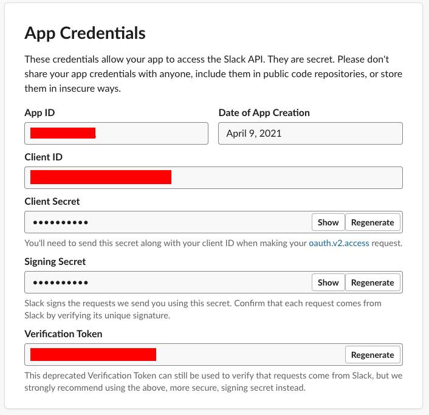
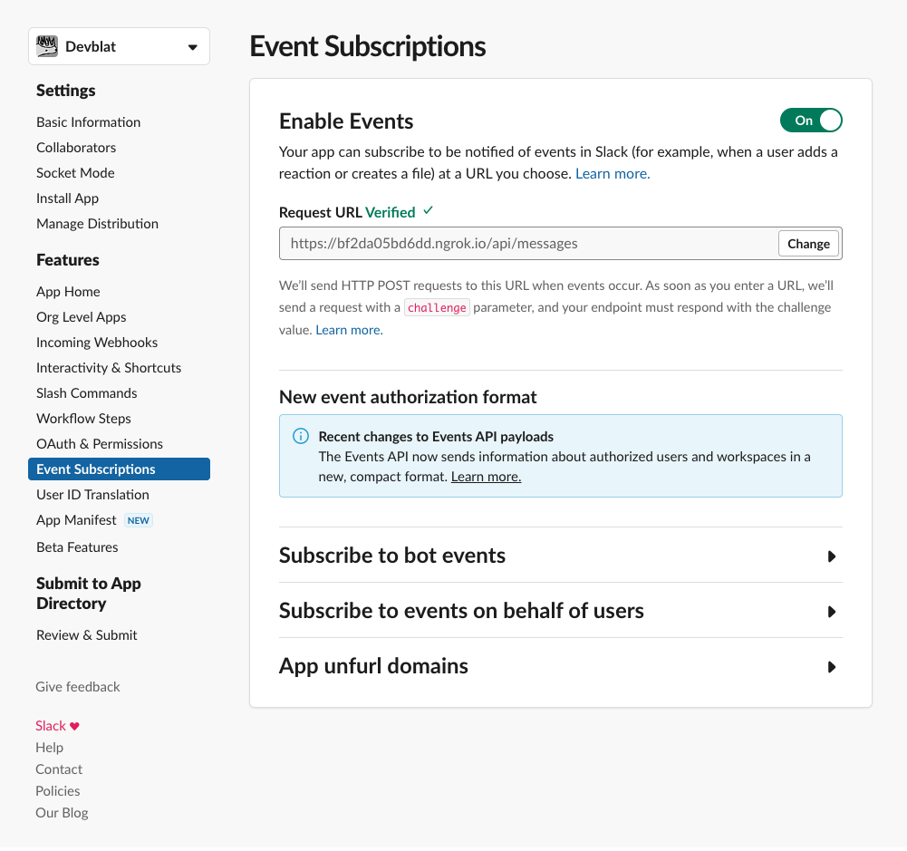

# Botkit Starter Kit

This is a Botkit starter kit for slack, created with the [Yeoman generator](https://github.com/howdyai/botkit/tree/master/packages/generator-botkit#readme).

To complete the configuration of this bot, make sure to update the included `.env` file with your platform tokens and credentials.

[Botkit Docs](https://botkit.ai/docs/v4)

This bot is powered by [a folder full of modules](https://botkit.ai/docs/v4/core.html#organize-your-bot-code).
Edit the samples, and add your own in the [features/](features/) folder.

# Running Locally

To run `pinbot` locally, you'll need to make sure you have Ngrok installed (`brew install ngrok`), and you'll likely want to set up a "Development" app so the production app can continue running with separate credentials.

First, set up your `.env` file:

```sh
cp .env.sample .env
```

Visit the App Credentials page https://api.slack.com/apps/{appId}/general and fill in the required values:



```sh
# Terminal #1
npm run watch

# Terminal #2
npm run dev

# Terminal #3
ngrok http 3000
```

Once you have an Ngrok tunnel set up, you'll need to edit the webhook URL that Slack posts messages to.

Visit the Event Subscriptions page https://api.slack.com/apps/{appId}/event-subscriptions and edit the Request URL.



It should look something like this: https://6edf-98-49-236-176.ngrok-free.app/api/messages, and Slack will send a request to verify the URL is listening.
